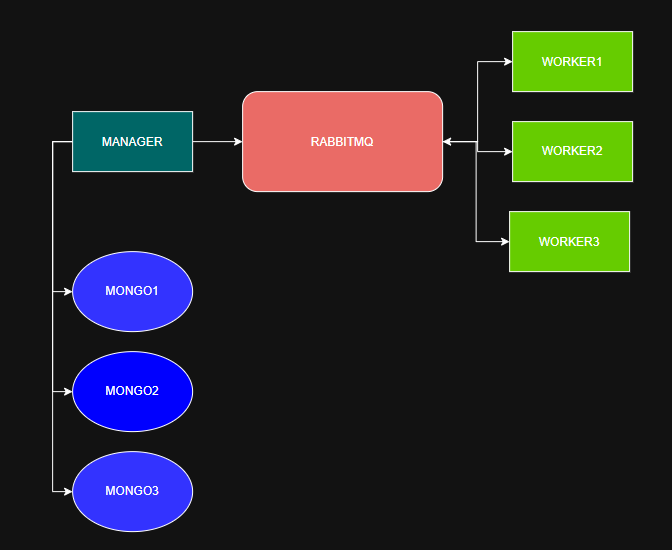

# CrackHash

Менеджер принимает запросы, разбивает задачу на части и отправляет воркерам.  
Воркеры перебирают строки в заданном диапазоне и возвращают найденные совпадения.


## Архитектура

Система состоит из следующих компонентов:

- **manager** - REST API, управление задачами и агрегация результатов
- **worker** - выполнение перебора строк
- **requests** - общие DTO и XML-модели для обмена данными

## API менеджера

Менеджер предоставляет внешний REST API для клиентов

1. Создание задачи

   POST /api/hash/crack
```bash
{
"hash": "5d41402abc4b2a76b9719d911017c592",
"maxLength": "maxLength"
}
```
Ответ
```bash
"requestId": "uuid"
```
2. Получение статуса задачи

   GET /api/hash/status?requestId=uuid

Ответ
```bash
  "status": "IN_PROGRESS",
  "data": []
```

## Статусы задач

1. **IN_PROGRESS** - задача выполняется
2. **HALF_READY** - часть воркеров завершила работу
3. **READY** - задача полностью завершена
4. **ERROR** - ошибка или превышен таймаут

## Запуск без Docker
```bash
./gradlew build
java -jar .\manager\build\libs\manager-0.0.1-SNAPSHOT.jar --server.port=8080
java -jar .\worker\build\libs\worker-0.0.1-SNAPSHOT.jar --server.port=8081
java -jar .\worker\build\libs\worker-0.0.1-SNAPSHOT.jar --server.port=8082
java -jar .\worker\build\libs\worker-0.0.1-SNAPSHOT.jar --server.port=8083
```

## Запуск с Docker
```bush
docker compose up --build
```

## Генерация хешей
https://emn178.github.io/online-tools/md5.html

## Схема
